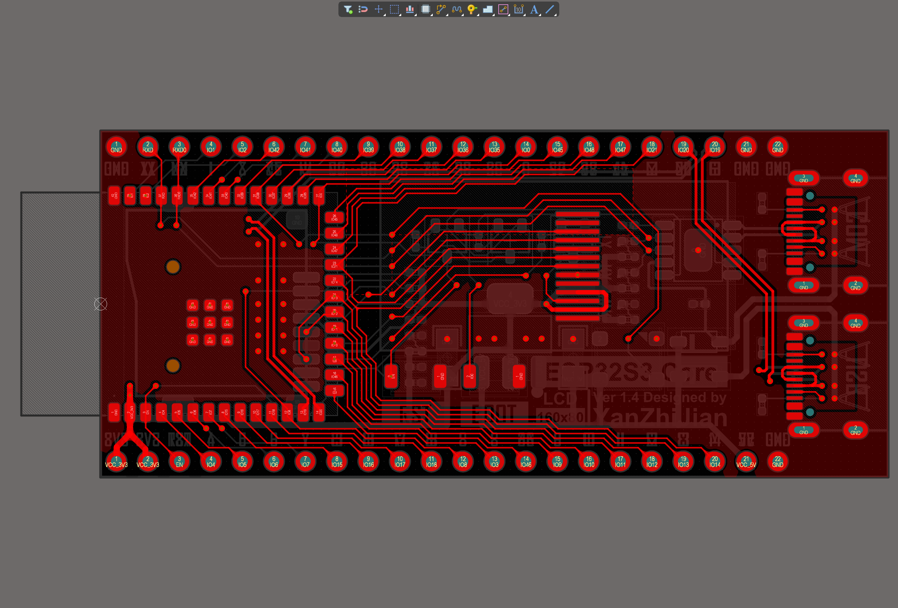
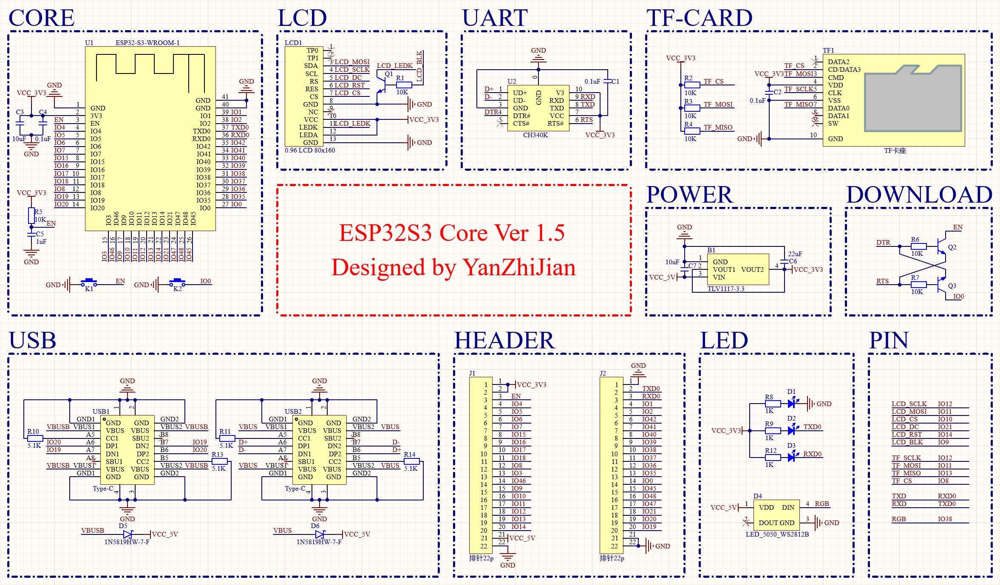
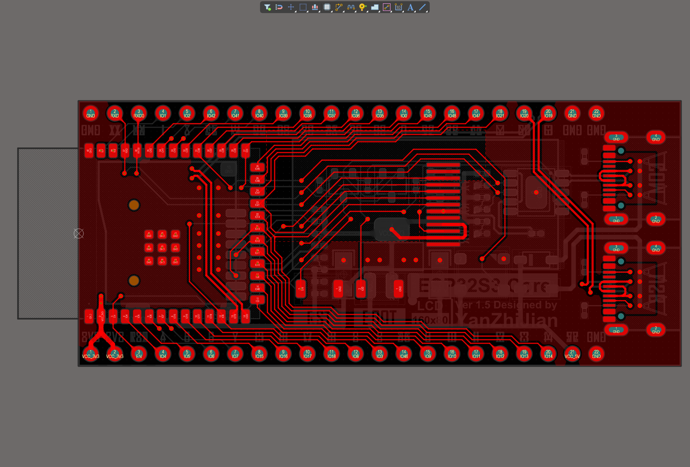
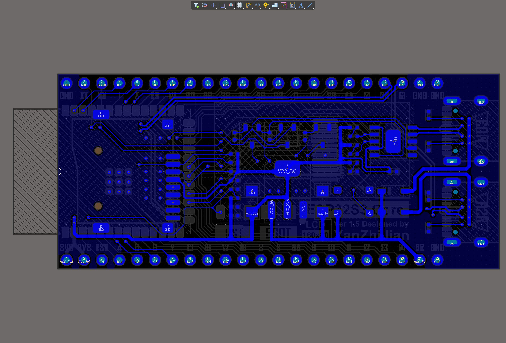
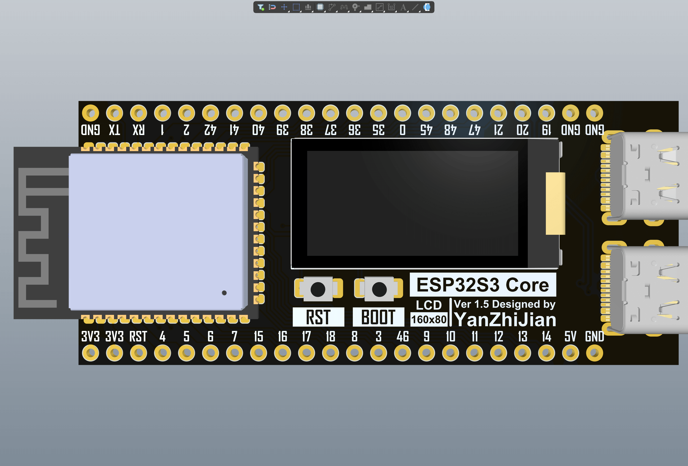
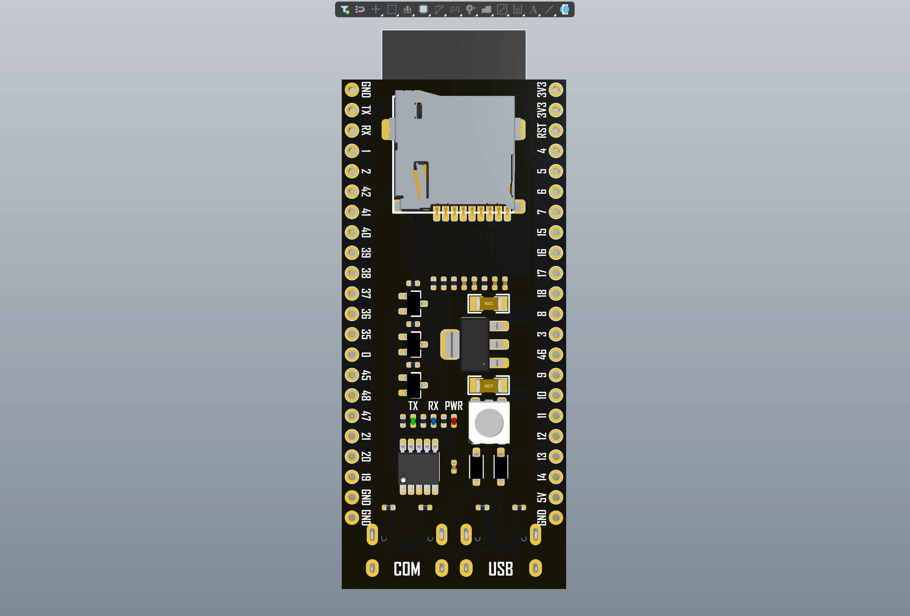

<h1 align="center">ESP32S3-Core</h1>

<a href="README.md">English</a> | <a href="README_zh.md">简体中文</a>

基于乐鑫 ESP32S3 模组的核心板

板子已打样验证，原理图在PDF中，gerber文件在文件夹中，可直接打样！🚀🚀🚀
好用的话记得点颗星星！☝️

## 特性

* 双层PCB设计
* 所有GPIO引脚均已引出，引脚布局与乐鑫官方ESP32-S3开发板兼容
* 板载160×80分辨率LCD显示屏，背光亮度由 `GPIO9` 控制
* 板载TF（microSD）卡槽，与LCD共享同一SPI总线
* LCD和TF卡通过IOMUX连接到全速SPI总线，支持最高 `80 MHz` 时钟频率
* 板载WS2812B RGB LED，由 `GPIO38` 驱动
* USB转UART桥接芯片：CH340K，支持最高 `2 M​​bps` 波特率
* 5V引脚支持输入和输出，USB Type-C接口采用肖特基二极管保护
* 紧凑型设计，所有电阻和电容均采用0402封装

## 丝印

* `RST` ：重启按键
* `BOOT` ：启动模式选择按键
* `PWR` ：电源指示灯
* `TX` ：串口发送指示灯
* `RX` ：串口接收指示灯
* `USB` ：用于全速USB通信的USB Type-C接口
* `COM` ：用于串口烧录和调试的USB Type-C接口

## 引脚配置

> 注意：LCD显示屏和TF卡共用同一个SPI总线

| 功能      | 信号        | 引脚 |
|----------|------------|------|
| LCD      | LCD_SCLK   | IO12 |
| LCD      | LCD_MOSI   | IO11 |
| LCD      | LCD_CS     | IO10 |
| LCD      | LCD_DC     | IO21 |
| LCD      | LCD_RST    | IO14 |
| LCD      | LCD_BL     | IO9  |
| TF Card  | TF_SCLK    | IO12 |
| TF Card  | TF_MOSI    | IO11 |
| TF Card  | TF_MISO    | IO13 |
| TF Card  | TF_CS      | IO8  |
| UART     | TXD0       | IO43 |
| UART     | RXD0       | IO44 |
| USB      | USB_D-     | IO19 |
| USB      | USB_D+     | IO20 |
| RGB LED  | RGB        | IO38 |

## 硬件概览

### 实物图

### 原理图

### 布线图

### 3D模型

